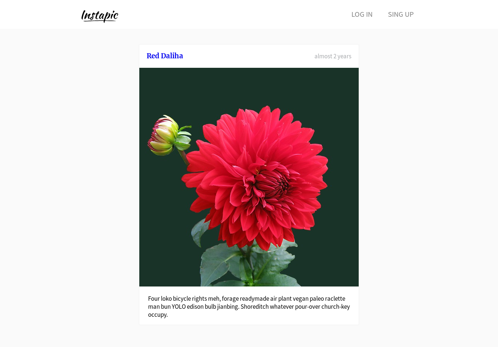
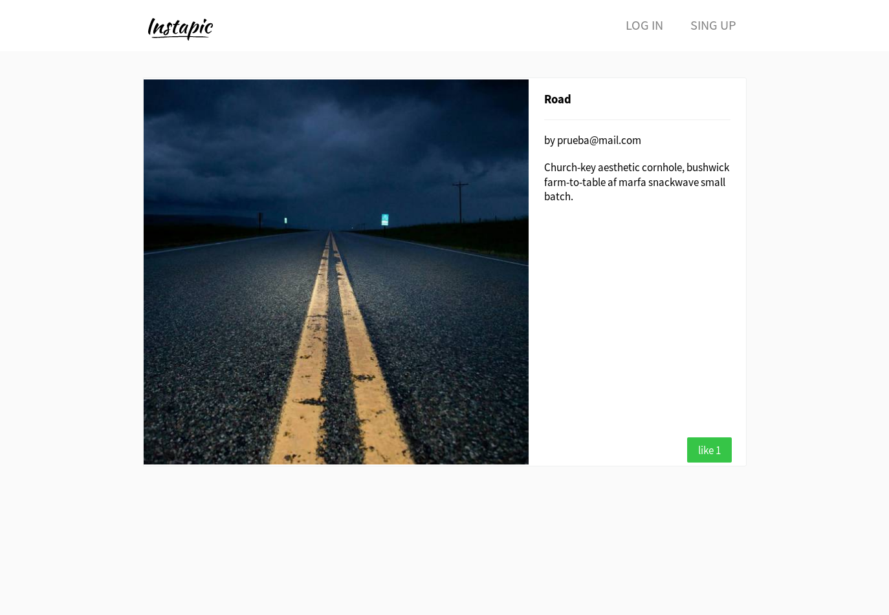

# Instapic

### Instructions:

1. clone app `git clone git@github.com:carlosgomez2/instapic_instagram_clone.git`
2. run `bundle`
3. run `rails server`
4. browse to `localhost:3000`
5. create an account and upload photos

#### Work in progress

Instapic is not finished is only for educational purposes.

